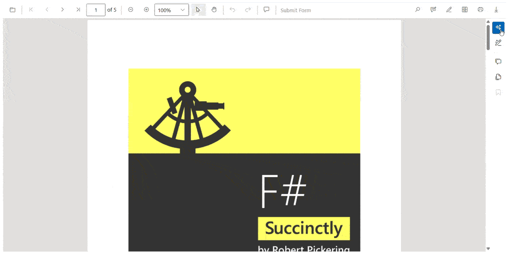

# Document Summarizer in Smart PDF Viewer

## Overview
The Document Summarizer feature in Syncfusion® Blazor Smart PDF Viewer leverages advanced AI capabilities to automatically generate intelligent summaries of PDF documents. This feature enables users to quickly understand document content through AI-powered summarization and interactive question-answering functionality, enhancing document comprehension and productivity.

## Key Features
- Intelligent Document Summarization: AI-powered automatic content summarization
- Interactive Q&A Interface: Ask questions about document content and receive contextual answers
- AI-Suggested Queries: Smart question suggestions based on document analysis
- Custom Query Support: Users can input their own specific questions about the document
- Multi-language Support: Process and summarize documents in various languages
- Real-time Processing: On-demand summarization with immediate results
- Context-Aware Responses: AI understands document structure and provides relevant answers

## Interactive Q&A Features
Users can interact with documents through:
- AI-Generated Questions: Smart suggestions based on document content analysis
- Custom Questions: User-defined queries about specific document aspects
- Contextual Answers: Responses that reference specific document sections
- Follow-up Queries: Ability to ask related questions based on previous answers
- Source Attribution: References to original document sections for verification

## Documentation
For detailed implementation guidance, visit: https://help.syncfusion.com/document-processing/pdf/smart-pdf-viewer/blazor/document-summarizer

## Project Prerequisites
- Visual Studio 2019 or later versions
- .NET Core SDK
- AI service configuration (OpenAI, Azure OpenAI, or custom AI service)
- Valid API credentials for the selected AI service
- Internet connection for AI service communication

## Running the Sample
1. Open the project in Visual Studio
2. Configure your AI service credentials in the application settings
3. Build the project to ensure all dependencies are resolved
4. To debug: Press F5 or select Debug > Start Debugging
5. To run without debugging: Press Ctrl+F5 or select Debug > Start Without Debugging

## Configuration Requirements
Ensure the following parameters are properly configured:
- AI service endpoint and authentication credentials
- Summarization model selection and parameters
- Response formatting and length preferences
- Language processing settings for multi-language support
- Performance optimization settings for large documents

## Usage Benefits
The Document Summarizer feature provides:
- Time-saving document review and analysis
- Enhanced document comprehension and retention
- Quick identification of key information and insights
- Improved decision-making through structured summaries
- Efficient document exploration through interactive queries
- Reduced reading time for lengthy documents
