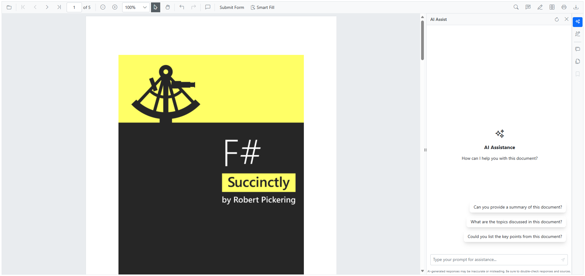
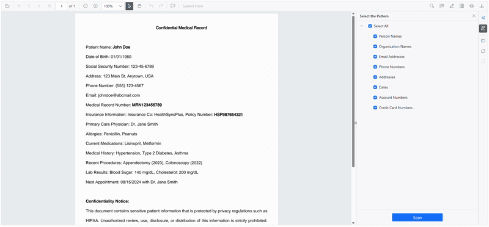
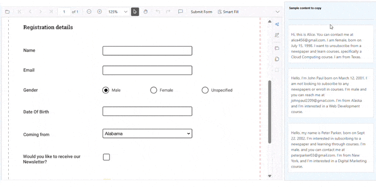

# Syncfusion® Blazor Smart PDF Viewer Examples

This repository contains comprehensive examples and samples for the **Syncfusion® Blazor Smart PDF Viewer** - an AI-powered PDF viewing and processing component that enhances document handling with intelligent features. The Smart PDF Viewer leverages advanced AI technologies to provide document summarization, smart form filling, and intelligent redaction capabilities.



## Key AI-Powered Features in Smart PDF Viewer

The Syncfusion® Blazor Smart PDF Viewer incorporates three powerful AI-driven features that revolutionize document processing:

### AI-Powered Document Summarization and Interactive Q&A

Advanced AI capabilities for intelligent document analysis and content understanding:
- Intelligent content extraction and semantic analysis using advanced NLP models
- Context-aware document summarization with key insights highlighting
- Interactive Q&A functionality enabling conversational document exploration
- Multi-language support for global document processing workflows
- Smart content categorization and automated topic identification


### Intelligent Document Redaction and Privacy Protection
AI-powered redaction system that intelligently identifies and protects sensitive information:
- Automatic detection of PII (Personally Identifiable Information) including SSN, emails, phone numbers
- Custom pattern recognition for domain-specific sensitive data (medical records, financial information)
- Smart context analysis for accurate redaction without over-blocking important content
- Customizable redaction patterns and industry-specific compliance rules
- Batch redaction capabilities for processing multiple documents efficiently



### AI-Enhanced Smart Form Filling and Data Extraction
Intelligent form filling system with advanced data extraction and field mapping capabilities:
- Extract relevant information from clipboard content, documents, or structured data sources
- Intelligently map extracted data to appropriate form fields with high accuracy



## Configuration and Setup Instructions

### System Requirements and Prerequisites
- .NET 8.0 or later
- Visual Studio 2022 (v17.4 or later) or Visual Studio Code with C# extension
- An active OpenAI API key or Azure OpenAI service subscription
- Minimum 4GB RAM for optimal AI processing performance
- Internet connection for AI service communication

### Configuring AI Service Credentials

To run AI samples, navigate to the `Program.cs` file in any sample project and replace the following placeholders with your actual credentials:

#### Azure OpenAI Configuration
```csharp
string apiKey = "your-api-key";
string deploymentName = "your-deployment-name";
string endpoint = "your-azure-endpoint-url";
```

Your Azure endpoint URL structure:
`https://{resource_name}.openai.azure.com/`

To use Azure OpenAI, install the [Azure.AI.OpenAI](https://www.nuget.org/packages/Azure.AI.OpenAI) package separately in your Blazor application.

#### OpenAI Configuration
If you are using **OpenAI**, [create an API key](https://help.openai.com/en/articles/4936850-where-do-i-find-my-openai-api-key) and configure as follows:

```csharp
string openAiKey = "your-openai-api-key";
string deploymentName = "gpt-3.5-turbo"; // or gpt-4, gpt-4-turbo
string endpoint = ""; // Leave empty for OpenAI
```

The `deploymentName` should be the [model](https://platform.openai.com/docs/models/) you wish to use (e.g., `gpt-3.5-turbo`, `gpt-4`, `gpt-4-turbo`).

## Quick Start Guide and Setup Instructions

### Step 1: Repository Setup
```bash
git clone https://github.com/syncfusion/blazor-smart-pdf-viewer-examples.git
cd blazor-smart-pdf-viewer-examples
```

### Step 2: Choose and Navigate to a Sample
```bash
cd "Getting Started/GettingStarted"
```

### Step 3: Configure AI Service Credentials
- Open `Program.cs` in your preferred editor
- Replace placeholder values with your actual AI service credentials
- Ensure proper API key format and endpoint configuration
- Save the configuration changes

### Step 4: Build and Run the Sample
```bash
dotnet restore
dotnet build
dotnet run
```

### Step 5: Access the Application
- Open your web browser
- Navigate to `https://localhost:5001` (HTTPS) or `http://localhost:5000` (HTTP)
- Upload a PDF document to test AI features
- Explore Document Summarization, Smart Redaction, and Smart Fill  capabilities
- Interact with the AI assistant for document analysis and Q&A

### Troubleshooting Common Issues
- **API Key Issues**: Verify your API key is valid and has sufficient quota
- **Network Connectivity**: Ensure stable internet connection for AI service calls
- **Port Conflicts**: Use `dotnet run --urls="https://localhost:5555"` for custom ports


## Multi-Platform AI Service Integration and Optimization
The repository provides comprehensive examples for integrating various AI service providers with optimized configurations:

- **Azure OpenAI Services**: Enterprise-grade AI integration with advanced security, compliance features, and scalable deployment options
- **OpenAI Platform**: Direct OpenAI API integration supporting the latest GPT models with custom fine-tuning capabilities
- **Google Gemini AI**: Advanced multimodal AI processing with superior language understanding and document analysis
- **Groq AI Infrastructure**: High-performance AI inference with specialized hardware acceleration for real-time applications

## Official Documentation

This table provides a comprehensive overview of all the Smart PDF Viewer AI features and samples in this repository, along with links to their respective documentation site for detailed implementation guidance and documentation.

<table>
    <thead>
        <tr>
            <th>Category</th>
            <th>Feature</th>
            <th>Description</th>
            <th>Documentation Link</th>
        </tr>
    </thead>
    <tbody>
        <tr>
            <td><strong>Getting Started</strong></td>
            <td>Basic AI Integration Setup</td>
            <td>Comprehensive introduction to Smart PDF Viewer with foundational AI functionality setup, including OpenAI/Azure OpenAI configuration and basic feature implementation.</td>
            <td><a href="https://help.syncfusion.com/document-processing/pdf/smart-pdf-viewer/blazor/getting-started/web-app">Read More</a></td>
        </tr>
        <tr>
            <td><strong>Document Summarization</strong></td>
            <td>AI Assistant Interface</td>
            <td>Customizable AI assistant interface with panel positioning, conversation history management, and response formatting options for optimal user experience.</td>
            <td><a href="https://help.syncfusion.com/document-processing/pdf/smart-pdf-viewer/blazor/document-summarizer">Read More</a></td>
        </tr>
        <tr>
            <td><strong>Smart Redaction</strong></td>
            <td>AI-Powered PII Detection</td>
            <td>Automatic detection and redaction of personally identifiable information (PII) including SSN, emails, phone numbers with context-aware analysis.</td>
            <td><a href="https://help.syncfusion.com/document-processing/pdf/smart-pdf-viewer/blazor/smart-redaction">Read More</a></td>
        </tr>
        <tr>
            <td><strong>Smart Form Filling</strong></td>
            <td>AI-Enhanced Form Completion</td>
            <td>Intelligent form filling with AI-powered data extraction from clipboard content, supporting various data formats and contextual field suggestions.</td>
            <td><a href="https://help.syncfusion.com/document-processing/pdf/smart-pdf-viewer/blazor/smart-fill">Read More</a></td>
        </tr>
    </tbody>
</table>

## Support and feedback

* For any other queries, reach our [Syncfusion® support team](https://www.syncfusion.com/support/directtrac/incidents/newincident) or post the queries through the [Community forums](https://www.syncfusion.com/forums) and submit a feature request or a bug through our [Feedback portal](https://www.syncfusion.com/feedback).
* To renew the subscription, click [renew](https://www.syncfusion.com/sales/products) or contact our sales team at salessupport@syncfusion.com | Toll Free: 1-888-9 DOTNET.

## License

Syncfusion JavaScript / Blazor Components is available under the Syncfusion Essential Studio program, and can be licensed either under the Syncfusion Community License Program or the Syncfusion commercial license.

To be qualified for the Syncfusion Community License Program, you must have gross revenue of less than one (1) million U.S. dollars (USD 1,000,000.00) per year and have less than five (5) developers in your organization, and agree to be bound by Syncfusion’s terms and conditions.

Customers who do not qualify for the community license can contact sales@syncfusion.com for commercial licensing options.

You may not use this product without first purchasing a Community License or a Commercial License, as well as agreeing to and complying with Syncfusion's license terms and conditions.

The Syncfusion® license that contains the terms and conditions can be found at
[https://www.syncfusion.com/content/downloads/syncfusion_license.pdf](https://www.syncfusion.com/content/downloads/syncfusion_license.pdf)

## About Syncfusion

Founded in 2001 and headquartered in Research Triangle Park, N.C., Syncfusion® has more than 29,000 customers and more than 1 million users, including large financial institutions, Fortune 500 companies, and global IT consultancies.

Today we provide 1,800+ controls and frameworks for web ([ASP.NET Core](https://www.syncfusion.com/aspnet-core-ui-controls), [ASP.NET MVC](https://www.syncfusion.com/aspnet-mvc-ui-controls), [ASP.NET WebForms](https://www.syncfusion.com/jquery/aspnet-web-forms-ui-controls), [JavaScript](https://www.syncfusion.com/javascript-ui-controls), [Angular](https://www.syncfusion.com/angular-ui-components), [React](https://www.syncfusion.com/react-ui-components), [Vue](https://www.syncfusion.com/vue-ui-components), and [Blazor](https://www.syncfusion.com/blazor-components), mobile ([Xamarin](https://www.syncfusion.com/xamarin-ui-controls), [Flutter](https://www.syncfusion.com/flutter-widgets), [UWP](https://www.syncfusion.com/uwp-ui-controls), and [JavaScript](https://www.syncfusion.com/javascript-ui-controls)), and desktop development ([WinForms](https://www.syncfusion.com/winforms-ui-controls), [WPF](https://www.syncfusion.com/wpf-ui-controls), and [UWP](https://www.syncfusion.com/uwp-ui-controls) and [WinUI](https://www.syncfusion.com/winui-controls))). We provide ready-to deploy enterprise software for dashboards, reports, data integration, and big data processing. Many customers have saved millions in licensing fees by deploying our software.